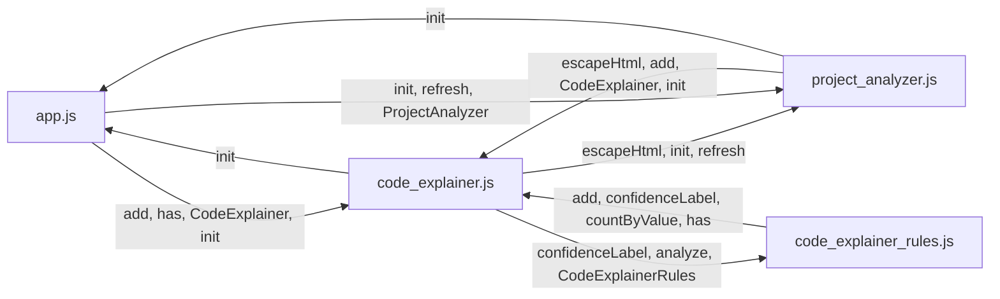

# V264 코드해석-프로젝트분석 경계 / 파일 간 연결 감사 리포트

AUDIT_CODE_EXPLAINER_CROSS_FILE_LINK_V264_A1

- 기준 커밋: cc29033
- 앱 버전: 20260611_v264_a1
- 대상 JS 파일: 4개
- 총평: PASS

## 1. 파일 요약

| file | lines | functions/classes | explicit exports | window objects |
|---|---:|---:|---:|---:|
| src/pwa/app.js | 3165 | 101 | 1 | 0 |
| src/pwa/code_explainer.js | 3706 | 140 | 1 | 1 |
| src/pwa/project_analyzer.js | 1463 | 56 | 1 | 1 |
| src/pwa/code_explainer_rules.js | 3046 | 56 | 1 | 1 |

## 2. HTML script 로딩 순서

### index.html
- script src 없음

### src/pwa/index.html
1. `src/pwa/code_explainer_rules.js`
2. `src/pwa/code_explainer.js`
3. `src/pwa/project_analyzer.js`
4. `src/pwa/app.js`

## 3. 전역 export / window object

| file | window object | exposed members |
|---|---|---|
| src/pwa/app.js | - | - |
| src/pwa/code_explainer.js | `CodeExplainer` | - |
| src/pwa/project_analyzer.js | `ProjectAnalyzer` | `refresh`, `buildProbeCommand`, `parseProbeOutput`, `renderProbeAnalysis`, `buildCodeBridgeSnippet` |
| src/pwa/code_explainer_rules.js | `CodeExplainerRules` | `analyze`, `detectLanguage` |

## 4. 파일 간 참조 상위 목록

| from file | references symbol | owner file | kind | count |
|---|---|---|---|---:|
| src/pwa/code_explainer.js | `escapeHtml` | src/pwa/project_analyzer.js | function | 70 |
| src/pwa/project_analyzer.js | `escapeHtml` | src/pwa/code_explainer.js | function | 38 |
| src/pwa/app.js | `add` | src/pwa/code_explainer.js | function | 24 |
| src/pwa/code_explainer_rules.js | `add` | src/pwa/code_explainer.js | function | 9 |
| src/pwa/app.js | `has` | src/pwa/code_explainer.js | function | 7 |
| src/pwa/app.js | `CodeExplainer` | src/pwa/code_explainer.js | global_object_export | 6 |
| src/pwa/app.js | `CodeExplainer` | src/pwa/code_explainer.js | window_object | 6 |
| src/pwa/code_explainer_rules.js | `confidenceLabel` | src/pwa/code_explainer.js | function | 5 |
| src/pwa/project_analyzer.js | `add` | src/pwa/code_explainer.js | function | 5 |
| src/pwa/app.js | `init` | src/pwa/code_explainer.js | function | 4 |
| src/pwa/app.js | `refresh` | src/pwa/code_explainer.js | function | 4 |
| src/pwa/app.js | `init` | src/pwa/project_analyzer.js | function | 4 |
| src/pwa/app.js | `refresh` | src/pwa/project_analyzer.js | function | 4 |
| src/pwa/app.js | `refresh` | src/pwa/project_analyzer.js | window_object_member:ProjectAnalyzer | 4 |
| src/pwa/code_explainer.js | `confidenceLabel` | src/pwa/code_explainer_rules.js | function | 4 |
| src/pwa/app.js | `ProjectAnalyzer` | src/pwa/project_analyzer.js | global_object_export | 3 |
| src/pwa/app.js | `ProjectAnalyzer` | src/pwa/project_analyzer.js | window_object | 3 |
| src/pwa/code_explainer.js | `init` | src/pwa/app.js | function | 3 |
| src/pwa/code_explainer.js | `init` | src/pwa/project_analyzer.js | function | 3 |
| src/pwa/code_explainer.js | `refresh` | src/pwa/project_analyzer.js | function | 3 |
| src/pwa/code_explainer.js | `refresh` | src/pwa/project_analyzer.js | window_object_member:ProjectAnalyzer | 3 |
| src/pwa/project_analyzer.js | `init` | src/pwa/app.js | function | 3 |
| src/pwa/project_analyzer.js | `CodeExplainer` | src/pwa/code_explainer.js | global_object_export | 3 |
| src/pwa/project_analyzer.js | `CodeExplainer` | src/pwa/code_explainer.js | window_object | 3 |
| src/pwa/project_analyzer.js | `init` | src/pwa/code_explainer.js | function | 3 |
| src/pwa/project_analyzer.js | `refresh` | src/pwa/code_explainer.js | function | 3 |
| src/pwa/app.js | `setLearningContent` | src/pwa/code_explainer.js | function | 2 |
| src/pwa/code_explainer.js | `analyze` | src/pwa/code_explainer_rules.js | function | 2 |
| src/pwa/code_explainer.js | `analyze` | src/pwa/code_explainer_rules.js | window_object_member:CodeExplainerRules | 2 |
| src/pwa/code_explainer.js | `CodeExplainerRules` | src/pwa/code_explainer_rules.js | global_object_export | 2 |
| src/pwa/code_explainer.js | `CodeExplainerRules` | src/pwa/code_explainer_rules.js | window_object | 2 |
| src/pwa/code_explainer_rules.js | `countByValue` | src/pwa/code_explainer.js | function | 1 |
| src/pwa/code_explainer_rules.js | `has` | src/pwa/code_explainer.js | function | 1 |

## 5. 파일 간 연결 Mermaid

## 6. 주요 관찰

- `src/pwa/code_explainer.js`는 `window.CodeExplainer`로 분석 API를 노출합니다.
- `code_explainer.js`는 `code_explainer_rules.js`의 규칙/유틸 이름을 참조합니다.
- `app.js`는 코드해석 UI 초기화/연결 흐름에서 `code_explainer.js` 계열 심볼을 참조합니다.

## 7. 경계 정리 / V265 후보

- 코드해석 메뉴는 단일 코드/단일 파일/선택 함수의 학습용 해석을 담당합니다.
- 프로젝트분석 메뉴는 여러 파일, script 로딩 순서, 전역 객체, 파일 간 연결, import/export 추적을 담당합니다.
- 따라서 V265는 `Project Analyzer`에 파일 간 연결 섹션을 통합하는 방향이 적절합니다.
- Code Explainer에는 선택 함수에서 `프로젝트분석에서 파일 간 연결 보기` 같은 연결 힌트만 두는 것이 좋습니다.
- 내부 호출/API 그룹화는 Code Explainer 안에서 계속 개선할 수 있습니다.
