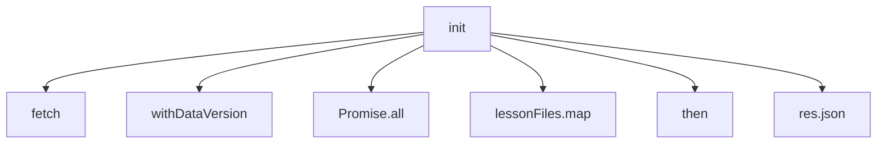
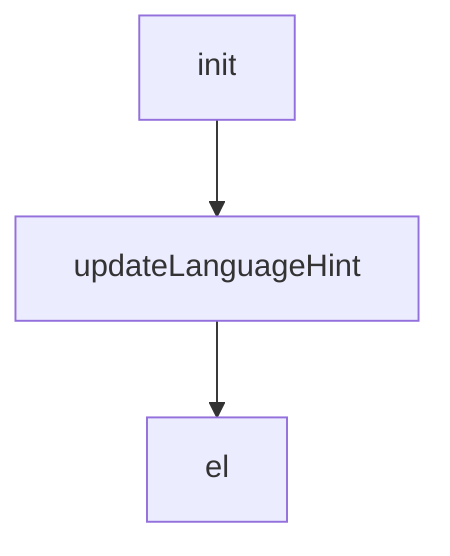
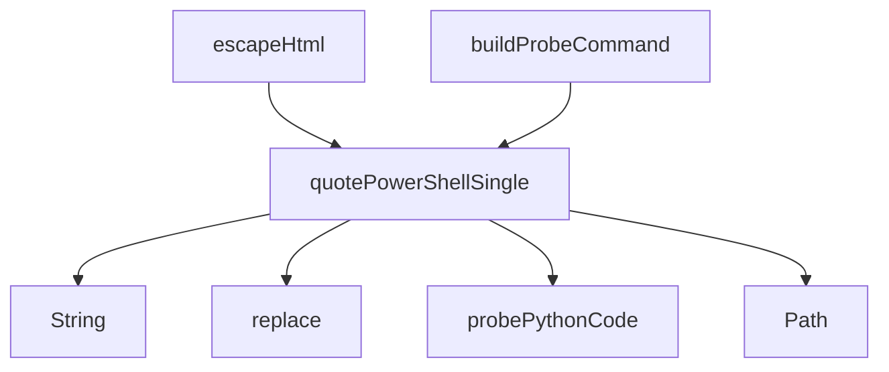
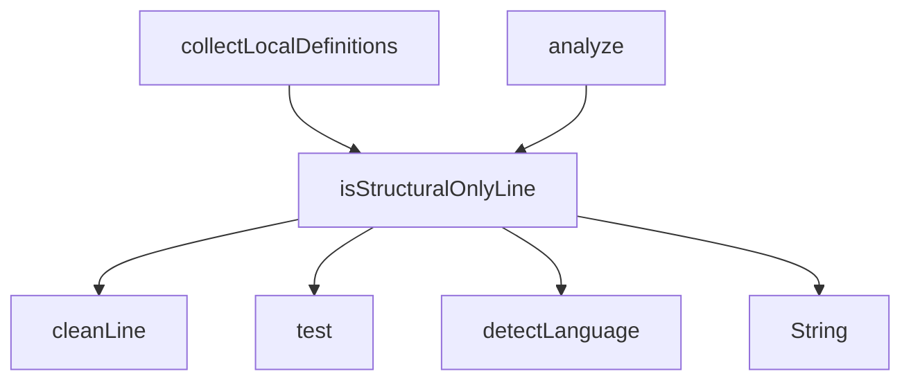

# V263 실제 대형 JS 코드해석 UX 감사 리포트

AUDIT_CODE_EXPLAINER_LARGE_FILE_UX_V263_A1

- 기준 커밋: 23a583e
- 앱 버전: 20260611_v263_a1
- 대상: 4개 실제 JS 파일
- 총평: PASS

## 요약

| file | 함수 후보 | 뼈대 | 검색 | 필터 | 선택 함수 | 문맥 | 호출자 | 내부호출 | 콜그래프 |
|---|---:|---|---|---|---|---|---:|---:|---|
| src/pwa/app.js | 123 | Y | Y | Y | init | Y | 0 | 16 | Y |
| src/pwa/code_explainer.js | 131 | Y | Y | Y | updateLanguageHint | Y | 1 | 1 | Y |
| src/pwa/project_analyzer.js | 55 | Y | Y | Y | quotePowerShellSingle | Y | 2 | 16 | Y |
| src/pwa/code_explainer_rules.js | 47 | Y | Y | Y | isStructuralOnlyLine | Y | 2 | 16 | Y |

## 주요 관찰

- src/pwa/app.js: 함수 후보가 123개라 기본 목록 상한 이후 탐색은 검색/필터 의존도가 높습니다.
- src/pwa/app.js: 선택 함수 내부 호출/API가 16개로 많아 노이즈 그룹화가 필요할 수 있습니다.
- src/pwa/code_explainer.js: 함수 후보가 131개라 기본 목록 상한 이후 탐색은 검색/필터 의존도가 높습니다.
- src/pwa/project_analyzer.js: 선택 함수 내부 호출/API가 16개로 많아 노이즈 그룹화가 필요할 수 있습니다.
- src/pwa/code_explainer_rules.js: 선택 함수 내부 호출/API가 16개로 많아 노이즈 그룹화가 필요할 수 있습니다.

## 권장 다음 작업

- V259~V262의 핵심 UX는 실제 대형 JS 파일에서도 작동합니다.
- 함수 수가 많은 파일에서는 기본 목록보다 검색/역할군 필터가 사실상 필수입니다.
- V262 콜그래프는 파일 내부 호출 관계에는 유효하지만, import/export를 통한 파일 간 연결은 아직 보지 못합니다.
- 다음 단계는 V264 파일 간 연결/import-export 추적이 적절합니다.
- 내부 호출/API가 많은 함수는 V265에서 DOM/API/유틸/내부함수 그룹화로 노이즈를 줄이는 것이 좋습니다.

## src/pwa/app.js

- 함수 후보 수: 123
- 전체 코드 뼈대 요약: Y
- 함수 목록/선택 해석: Y
- 검색 입력: Y
- 역할군 필터: Y
- 선택 감사 함수: init
- 선택 기준: async/fetch/await
- 선택 함수 문맥: Y
- 호출자 수: 0
- 내부 호출/API 수: 16
- 콜그래프 생성: Y

### 콜그래프 미리보기

### 선택 함수 화면 신호

- 선택 함수 상세 해석 유지: Y
- 함수 흐름도 유지: Y
- 호출 관계 그래프 섹션: Y

## src/pwa/code_explainer.js

- 함수 후보 수: 131
- 전체 코드 뼈대 요약: Y
- 함수 목록/선택 해석: Y
- 검색 입력: Y
- 역할군 필터: Y
- 선택 감사 함수: updateLanguageHint
- 선택 기준: async/fetch/await
- 선택 함수 문맥: Y
- 호출자 수: 1
- 내부 호출/API 수: 1
- 콜그래프 생성: Y

### 콜그래프 미리보기

### 선택 함수 화면 신호

- 선택 함수 상세 해석 유지: Y
- 함수 흐름도 유지: Y
- 호출 관계 그래프 섹션: Y

## src/pwa/project_analyzer.js

- 함수 후보 수: 55
- 전체 코드 뼈대 요약: Y
- 함수 목록/선택 해석: Y
- 검색 입력: Y
- 역할군 필터: Y
- 선택 감사 함수: quotePowerShellSingle
- 선택 기준: async/fetch/await
- 선택 함수 문맥: Y
- 호출자 수: 2
- 내부 호출/API 수: 16
- 콜그래프 생성: Y

### 콜그래프 미리보기

### 선택 함수 화면 신호

- 선택 함수 상세 해석 유지: Y
- 함수 흐름도 유지: Y
- 호출 관계 그래프 섹션: Y

## src/pwa/code_explainer_rules.js

- 함수 후보 수: 47
- 전체 코드 뼈대 요약: Y
- 함수 목록/선택 해석: Y
- 검색 입력: Y
- 역할군 필터: Y
- 선택 감사 함수: isStructuralOnlyLine
- 선택 기준: async/fetch/await
- 선택 함수 문맥: Y
- 호출자 수: 2
- 내부 호출/API 수: 16
- 콜그래프 생성: Y

### 콜그래프 미리보기

### 선택 함수 화면 신호

- 선택 함수 상세 해석 유지: Y
- 함수 흐름도 유지: Y
- 호출 관계 그래프 섹션: Y
