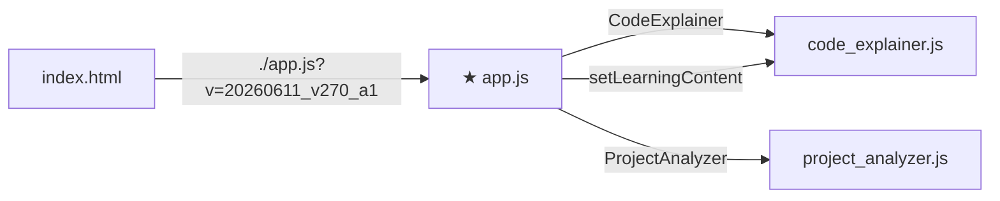
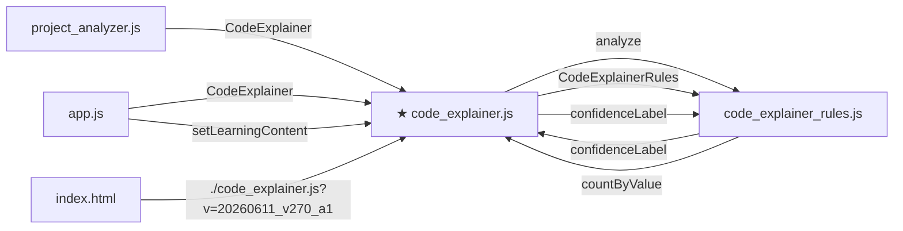
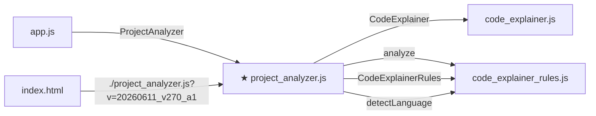

# V270 실제 Project Analyzer 파일 중심 필터 감사 리포트

AUDIT_PROJECT_ANALYZER_CROSS_FILE_FOCUS_FILTER_V270_A1

- 앱 버전: 20260611_v270_a1
- 대상 파일: 5개
- 전체 파일 간 연결 후보: 16개
- 필터 기준 파일: 3개
- 총평: PASS

## 1. 사용 가능한 파일 필터

- src/pwa/app.js
- src/pwa/code_explainer_rules.js
- src/pwa/code_explainer.js
- src/pwa/index.html
- src/pwa/project_analyzer.js

## 2. 파일 중심 필터 감사 결과

| focus file | available | focused links | only related | shrunk | rendered | mermaid rendered |
|---|---|---:|---|---|---|---|
| src/pwa/app.js | Y | 4 | Y | Y | Y | Y |
| src/pwa/code_explainer.js | Y | 9 | Y | Y | Y | Y |
| src/pwa/project_analyzer.js | Y | 6 | Y | Y | Y | Y |

## 3. 전체 연결 후보 상위 목록

| from | to | symbol | kind | confidence | count |
|---|---|---|---|---|---:|
| src/pwa/app.js | src/pwa/code_explainer.js | CodeExplainer | call-to-symbol | high | 6 |
| src/pwa/project_analyzer.js | src/pwa/code_explainer.js | CodeExplainer | call-to-symbol | high | 4 |
| src/pwa/app.js | src/pwa/project_analyzer.js | ProjectAnalyzer | call-to-symbol | high | 3 |
| src/pwa/code_explainer.js | src/pwa/code_explainer_rules.js | analyze | call-to-symbol | high | 2 |
| src/pwa/code_explainer.js | src/pwa/code_explainer_rules.js | CodeExplainerRules | call-to-symbol | high | 2 |
| src/pwa/index.html | src/pwa/app.js | ./app.js?v=20260611_v270_a1 | file-reference | high | 1 |
| src/pwa/index.html | src/pwa/code_explainer_rules.js | ./code_explainer_rules.js?v=20260611_v270_a1 | file-reference | high | 1 |
| src/pwa/index.html | src/pwa/code_explainer.js | ./code_explainer.js?v=20260611_v270_a1 | file-reference | high | 1 |
| src/pwa/index.html | src/pwa/project_analyzer.js | ./project_analyzer.js?v=20260611_v270_a1 | file-reference | high | 1 |
| src/pwa/project_analyzer.js | src/pwa/code_explainer_rules.js | analyze | call-to-symbol | high | 1 |
| src/pwa/project_analyzer.js | src/pwa/code_explainer_rules.js | CodeExplainerRules | call-to-symbol | high | 1 |
| src/pwa/project_analyzer.js | src/pwa/code_explainer_rules.js | detectLanguage | call-to-symbol | high | 1 |
| src/pwa/code_explainer_rules.js | src/pwa/code_explainer.js | confidenceLabel | call-to-symbol | medium | 4 |
| src/pwa/code_explainer.js | src/pwa/code_explainer_rules.js | confidenceLabel | call-to-symbol | medium | 3 |
| src/pwa/app.js | src/pwa/code_explainer.js | setLearningContent | call-to-symbol | medium | 2 |
| src/pwa/code_explainer_rules.js | src/pwa/code_explainer.js | countByValue | call-to-symbol | medium | 1 |

## 4. 파일별 Mermaid 요약

### src/pwa/app.js

### src/pwa/code_explainer.js

### src/pwa/project_analyzer.js

## 5. 결론 / 다음 후보

- V269 파일 중심 필터는 실제 프로젝트 파일 기준에서도 동작합니다.
- 특정 파일을 선택하면 해당 파일이 보내거나 받는 연결만 남습니다.
- 다음 단계는 Project Analyzer에 연결 상세 패널을 추가해 symbol별 근거 snippet을 펼쳐 보는 방향이 적절합니다.
