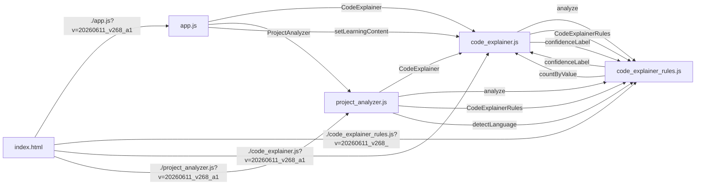

# V268 실제 Project Analyzer 파일 간 연결 UI 감사 리포트

AUDIT_PROJECT_ANALYZER_CROSS_FILE_UI_V268_A1

- 앱 버전: 20260611_v268_a1
- 대상 파일: 5개
- 총평: PASS

## 1. 실제 스캔 요약

- symbol 파일 수: 4
- call candidate 파일 수: 4
- reference 파일 수: 1
- 최종 파일 간 연결 후보: 16
- high 신뢰도 연결: 12
- generic 노이즈 잔존: 0

## 2. V267 그룹 요약

| group | key | count |
|---|---|---:|
| 전역 객체 / 공개 API 연결 | public-api | 8 |
| 파일 참조 / 로딩 연결 | file-reference | 4 |
| 함수 호출 후보 | function-call | 4 |

## 3. 상위 파일 간 연결 후보

| from | to | symbol | kind | confidence | count |
|---|---|---|---|---|---:|
| src/pwa/app.js | src/pwa/code_explainer.js | CodeExplainer | call-to-symbol | high | 6 |
| src/pwa/project_analyzer.js | src/pwa/code_explainer.js | CodeExplainer | call-to-symbol | high | 4 |
| src/pwa/app.js | src/pwa/project_analyzer.js | ProjectAnalyzer | call-to-symbol | high | 3 |
| src/pwa/code_explainer.js | src/pwa/code_explainer_rules.js | analyze | call-to-symbol | high | 2 |
| src/pwa/code_explainer.js | src/pwa/code_explainer_rules.js | CodeExplainerRules | call-to-symbol | high | 2 |
| src/pwa/index.html | src/pwa/app.js | ./app.js?v=20260611_v268_a1 | file-reference | high | 1 |
| src/pwa/index.html | src/pwa/code_explainer_rules.js | ./code_explainer_rules.js?v=20260611_v268_a1 | file-reference | high | 1 |
| src/pwa/index.html | src/pwa/code_explainer.js | ./code_explainer.js?v=20260611_v268_a1 | file-reference | high | 1 |
| src/pwa/index.html | src/pwa/project_analyzer.js | ./project_analyzer.js?v=20260611_v268_a1 | file-reference | high | 1 |
| src/pwa/project_analyzer.js | src/pwa/code_explainer_rules.js | analyze | call-to-symbol | high | 1 |
| src/pwa/project_analyzer.js | src/pwa/code_explainer_rules.js | CodeExplainerRules | call-to-symbol | high | 1 |
| src/pwa/project_analyzer.js | src/pwa/code_explainer_rules.js | detectLanguage | call-to-symbol | high | 1 |
| src/pwa/code_explainer_rules.js | src/pwa/code_explainer.js | confidenceLabel | call-to-symbol | medium | 4 |
| src/pwa/code_explainer.js | src/pwa/code_explainer_rules.js | confidenceLabel | call-to-symbol | medium | 3 |
| src/pwa/app.js | src/pwa/code_explainer.js | setLearningContent | call-to-symbol | medium | 2 |
| src/pwa/code_explainer_rules.js | src/pwa/code_explainer.js | countByValue | call-to-symbol | medium | 1 |

## 4. 노이즈 필터 확인

- 검사한 generic symbol: `add`, `has`, `init`, `refresh`, `escapeHtml`
- call-to-symbol로 남은 generic 연결: 0
- 결과: generic 함수명 연결은 표시 후보에서 제거됨

## 5. 렌더링 확인

- 파일 간 연결 섹션 렌더링: Y
- V267 그룹 문구 렌더링: Y
- 공개 API 그룹 렌더링: Y
- 파일 참조 그룹 렌더링: Y
- Mermaid 접힘 코드 렌더링: Y

## 6. Mermaid 요약

## 7. 결론 / 다음 후보

- V267 UI 그룹은 실제 프로젝트 파일 기준에서도 동작합니다.
- V266 노이즈 필터는 흔한 함수명 연결을 줄이는 데 유효합니다.
- 다음 단계는 Project Analyzer에서 특정 파일을 선택하면 관련 연결만 좁혀 보는 파일 중심 필터가 적절합니다.
